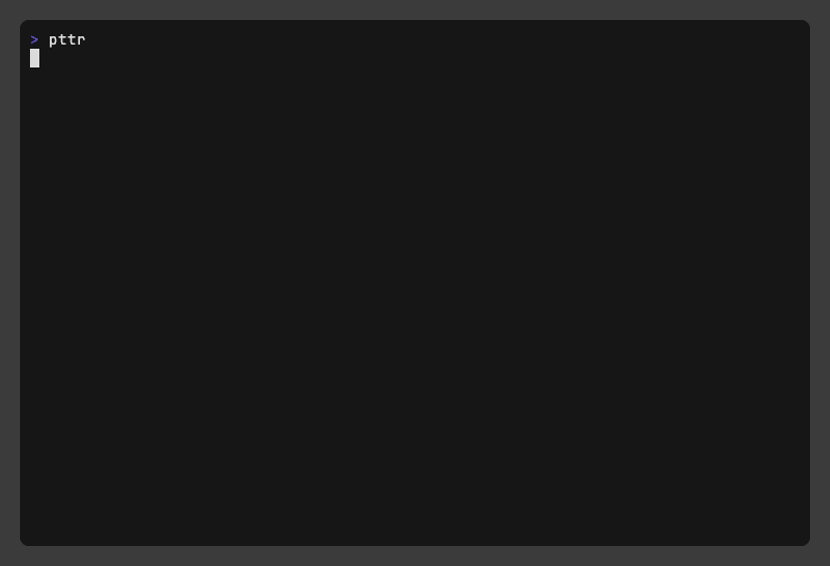

# pttr

A cross-platform terminal UI application for viewing and managing open ports - process on your system.

## Features

- **Cross-platform**: Works on macOS, Linux, and Windows
- **Modern Terminal UI**: Beautiful interface with colors, icons, and visual indicators
- **Triple View Modes**: Toggle between viewing open ports, running processes, and network interfaces
- **Port Detection**: Automatically scans for open ports and listening services
- **Process Management**: Kill processes by PID with a single keypress
- **Real-time Updates**: Refresh current view on demand
- **Filtering**: Search and filter by name, process, port number, or PID
- **Visual Resource Monitoring**: CPU and memory usage bars with color-coded indicators

# :movie_camera: Demo



### Enhanced Process View
- **Smart Process Names**: Shows user-friendly names (e.g., "Google Chrome" instead of "chrome")
- **Fast Process Icons**: Optimized text-based icons ([Web], [Dev], [DB], [Sys], etc.)
- **Multiple Sort Modes**: Sort by CPU usage (default), memory usage, name, or PID (works in both flat and tree view)
- **Enhanced Process Tree**: Proper tree structure with ├── and └── symbols, sorted at each level
- **Visual Resource Usage**: CPU and memory bars with color-coded indicators (░▒▓█)
- **High Usage Alerts**: 🔥 for high CPU, 💾 for high memory usage
- **Parent Process Info**: Shows parent PID for process relationships
- **Smart Filtering**: Filter/search works correctly without interfering with hotkeys
- **High Performance**: Optimized for fast loading and responsive UI
- **Flexible Startup**: Start with either ports or processes view using command line flags
- **Permission Management**: Intelligent permission checking with sudo suggestions

# :battery: Installation

#### Quick install

You can run the below `curl` to install it somewhere in your PATH for easy use. Ideally it will be installed at `./bin`
folder

```shell
curl -sfL https://raw.githubusercontent.com/abhimanyu003/pttr/main/install.sh | sh
```

#### Homebrew

If you are on macOS and using Homebrew, you can install `pttr` with the following:

```shell
brew install abhimanyu003/pttr/pttr
```

#### Snap

```shell
sudo snap install pttr
```

#### Arch Linux

```shell
yay -S pttr-bin
```

#### Scoop

```shell
scoop bucket add pttr https://github.com/abhimanyu003/scoop-bucket.git
scoop install pttr
```

#### Go

```shell
go install github.com/abhimanyu003/pttr@latest
```

#### Binary

**MacOS**
[Binary](https://github.com/abhimanyu003/pttr/releases/latest/download/pttr_Darwin_all.tar.gz) ( Multi-Architecture )

**Linux (Binaries)**
[amd64](https://github.com/abhimanyu003/pttr/releases/latest/download/pttr_Linux_x86_64.tar.gz) | [arm64](https://github.com/abhimanyu003/pttr/releases/latest/download/pttr_Linux_arm64.tar.gz) | [i386](https://github.com/abhimanyu003/pttr/releases/latest/download/pttr_Linux_i386.tar.gz)

**Windows (Exe)**
[amd64](https://github.com/abhimanyu003/pttr/releases/latest/download/pttr_Windows_x86_64.zip) | [arm64](https://github.com/abhimanyu003/pttr/releases/latest/download/pttr_Windows_arm64.zip) | [i386](https://github.com/abhimanyu003/pttr/releases/latest/download/pttr_Windows_i386.zip)

**FreeBSD (Binaries)**
[amd64](https://github.com/abhimanyu003/pttr/releases/latest/download/pttr_Freebsd_x86_64.tar.gz) | [arm64](https://github.com/abhimanyu003/pttr/releases/latest/download/pttr_Freebsd_arm64.tar.gz) | [i386](https://github.com/abhimanyu003/pttr/releases/latest/download/pttr_Freebsd_i386.tar.gz)

#### Manually

Download the pre-compiled binaries from the [Release!](https://github.com/abhimanyu003/pttr/releases) page and copy them
to the desired location.


### Fallback Mechanisms
The application includes comprehensive fallback mechanisms:
- If `lsof` is not available, falls back to `netstat`
- If extended `ps` options fail, uses basic `ps` commands
- Multiple kill methods for different permission levels
- Graceful degradation when commands are not available

### Permission Management
- **Automatic Detection**: Shows current user and privilege level
- **Smart Error Messages**: Identifies permission-related failures
- **Sudo Suggestions**: Recommends using sudo when needed
- **Safe Testing**: Pre-checks permissions before attempting to kill processes

### Running with Elevated Privileges
```bash
# For killing system processes
sudo pttr
```


# Contribution

This project welcomes your PR and issues. For example, refactoring, adding features, correcting English, etc.
If you need any help, you can contact me on [Twitter](https://twitter.com/abhimanyu003).

Thanks to all the people who already contributed!

<a href="https://github.com/abhimanyu003/pttr/graphs/contributors">
  
</a>

# License

[MIT](./LICENSE)